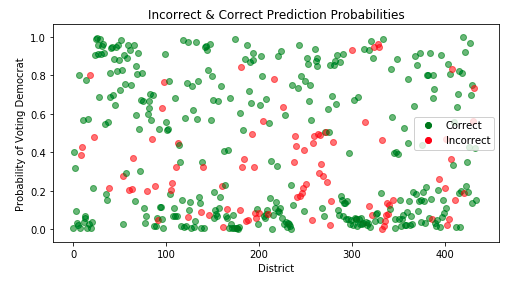

# Models

## Baseline Model
We wanted to create a baseline model based off of previous midterm election results. We create a dataset where each row in the model represents a specific district in a specific year from 1976-2016 (see the EDA page for more info). Our predictors included state, district, and the number of votes for the republican candidates and democratic candidates in the 2 elections prior to the given election.

Because we could not use the current year's results as a predictor, we used the results from the previous two midterm elections in our model. For example, to predict the outcome of 2000Alabama1 we could not use the number of republican and democratic votes from that year (because we wouldn't have that for 2018), so instead we used the vote counts from 1998Alabama1 (one election prior) and 1996Alabama1 (two elections prior). Below we use the `all_past_elections` dataframe (described in EDA) to appropriately assign those values. We then combine these new results in a new data frame.

```
# separate into test and training data
columns = ['state']
past_elections_dummies = pd.get_dummies(past_elections, columns=columns, drop_first=True)

election_2018 = past_elections_dummies.loc[past_elections['year'] == 2018]
all_past_elections = past_elections_dummies.loc[past_elections['year'] != 2018]
```

```
past_res =  all_past_elections['res']
all_past_elections = all_past_elections.drop(columns=['res', 'id'])
election_res_2018 =  election_2018['res']
election_2018 = election_2018.drop(columns=['res', 'id'])
```

We ran a logistic regression model on the data at this point and found a training accuracy score of **78.22%** and a test accuracy score of **79.08%**.

```
X_train, y_train = normalize(all_past_elections.astype(float)), past_res.astype(float)
X_test, y_test = normalize(election_2018.astype(float)), election_res_2018.astype(float)

log_model = LogisticRegression(C=100000, solver='lbfgs', max_iter=1000).fit(X_train, y_train)

y_pred_log_train = log_model.predict(X_train)
y_proba_log_test = log_model.predict_proba(X_train)

y_pred_log_test = log_model.predict(X_test)
y_proba_log_test = log_model.predict_proba(X_test)

train_acc = accuracy_score(y_train, y_pred_log_train)*100
test_acc = accuracy_score(y_test, y_pred_log_test)*100
```

The above model yielded the following results:

- **Training Accuracy Score**: 78.22%
- **Test Accuracy Score**: 79.08%



We created a confusion matrix of the results which yielded the following:

|         | Predicted 0 | Predicted 1 |
|------------------------|
|**Actual 0**| 187  | 16    |
|**Actual 1**| 75   | 157   |

From the above confusion matrix, we can see that the baseline model does an okay job of predicting election outcomes, but, for the test data, had a tendency to predict incorrectly for districts where democrats won.

# Next Steps

We returned to one of our original visualization (found on the EDA page) to identify voting trends among the states to assist in predicting the midterm outcomes. For example, if a state historically voted heavily Democrat (Massachusetts), then we want our model to weight the likelihood of any Democrat running in MA much heavier than a Republican state such as Texas. We also wanted to identify potential swing states, or states that historically voted on way but have been trending towards the other party in recent years. We graphed the percentage of votes Republicans, Democrats, and Independents received per state in Senate elections from 1976-2016. From this collection of graphs, we can identify many trends occurring in different states. We can also see many states used to heavily favor one party then began voting in the other direction. For example, southern states such as AL and OK used to vote heavily Democrat until they switched to heavy Republican, likely a result of the Southern Bloc.

Noting these trends in the Senate data inspired us to further explore swing seats in the Senate specifically. We explain how this changed our project direction more on the [results page](results).

# Final Model
We looked to greatly improve our model from the previous milestone, so we expanded the scope of the data to many other areas as mentioned previously. We first started by switching from using 1976-2016 House election data to 1976-2016 Senate election data, obviously much more relevant to our prediction goals. From there, we looked to integrate fundraising numbers, incumbency vs. challenger vs. open seat status, and previous election party voting polarization into the model.

The issue was figuring out how to merge of all this data together into one dataset so a model could easily train on it. We had two main sources of data - fundraising per year from 2012 elections onwards which integrated the status of the candidate (incumbent vs. challenger vs. open seat) into it and voting numbers from 1976-2016. We ultimately decided to use voting numbers from the 2006 election and append them to 2012 fundraising data so we could have the previous state election’s voter data based on party. We did the same from 2008/2014 and 2010/2016 election data, and appended 2012 data to 2018 election data for predictions. We decided not to use any data prior to 2008 since it was difficult with the fundraising data going back only to 2012, and we felt the most recent elections we more relevant anyways.

Each row in the fundraising data was a specific candidate, so our model was trained on everything related to a candidate including their state, candidate status, party, party’s previous election vote percentage, and fundraising amounts. The problem with this, however, is training a model and simply predicting on the 2018 fundraising data does not take into account the one winner per senate seat rule. This could lead to the model predicting multiple winners for one senate seat and none for others. To overcome this issue, we predicted the probability that each candidate would win the election and grouped each candidate and his/her predicted probability per state. We then chose the candidate with the highest predicted probability of winning as the winner.

Our final model uses **Logistic Regression** run with the liblinear library and l1 regularization. We used 5-fold cross-validation in the training process as well. This resulted in, depending the train-test split, a training accuracy of ~0.92 and testing accuracy of ~0.87-0.92. We ran many other models including different types of logistic regressions, KNN, AdaBoostClassifier, and random forests, but we found our specific logistic regression model to find a good balance between accuracy and not overfitting.

```
X_train, X_test, y_train, y_test = train_test_split(fundraising.loc[:, fundraising.columns != 'elected'],
                                                    fundraising.elected, test_size=0.25)
```

```
logis_cv_model = LogisticRegressionCV(solver='liblinear', penalty='l1', max_iter=1000, cv=5).fit(X_train, y_train)
```
The above model yielded the following results:

- **Training Accuracy Score**: 89.34%
- **Test Accuracy Score**: 93.46%

The results of our final model can be found [here](results).

### Other Models
The below are additional models we tested that did perform as well (in terms of accuracy and overfitting) as our chose model.
```
logis_cv_model1 = LogisticRegressionCV(max_iter=1000, cv=5).fit(X_train, y_train)
```
- **Training Accuracy Score**: 73.67%
- **Test Accuracy Score**: 71.96%

```
ks = [1,2,3,4,5,7,9,10,15,25]
means = []
for k in ks:
    knn_model = KNeighborsClassifier(n_neighbors=k)
    scores = cross_val_score(knn_model, X_train, y_train, cv=5)
    print('{} mean: {}'.format(k, np.mean(scores)))
    means.append(scores)
```
```
1 mean: 0.8527281746031747
2 mean: 0.8402281746031747
3 mean: 0.8181547619047619
4 mean: 0.7960813492063492
5 mean: 0.8148313492063493
7 mean: 0.777281746031746
9 mean: 0.8181051587301587
10 mean: 0.8055059523809524
15 mean: 0.8212301587301587
25 mean: 0.8181547619047619
```


```
for i in range(3, 15):
    abc_model = AdaBoostClassifier(base_estimator=DecisionTreeClassifier(max_depth=i), learning_rate=0.05, n_estimators=100).fit(X_train, y_train)
    abc_train_score = list(abc_model.staged_score(X_train, y_train))
    abc_test_score = list(abc_model.staged_score(X_test, y_test))
    print('Depth {} training acccuracy: {}'.format(i, abc_train_score[len(abc_train_score)-1]))
    print('Depth {} testing acccuracy: {}'.format(i, abc_test_score[len(abc_test_score)-1]))
```
```
Depth 3 training acccuracy: 1.0
Depth 3 testing acccuracy: 0.8411214953271028
Depth 4 training acccuracy: 1.0
Depth 4 testing acccuracy: 0.897196261682243
Depth 5 training acccuracy: 1.0
Depth 5 testing acccuracy: 0.8691588785046729
Depth 6 training acccuracy: 1.0
Depth 6 testing acccuracy: 0.897196261682243
Depth 7 training acccuracy: 1.0
Depth 7 testing acccuracy: 0.8411214953271028
Depth 8 training acccuracy: 1.0
Depth 8 testing acccuracy: 0.8691588785046729
Depth 9 training acccuracy: 1.0
Depth 9 testing acccuracy: 0.897196261682243
Depth 10 training acccuracy: 1.0
Depth 10 testing acccuracy: 0.8785046728971962
Depth 11 training acccuracy: 1.0
Depth 11 testing acccuracy: 0.8691588785046729
Depth 12 training acccuracy: 1.0
Depth 12 testing acccuracy: 0.8598130841121495
Depth 13 training acccuracy: 1.0
Depth 13 testing acccuracy: 0.8598130841121495
Depth 14 training acccuracy: 1.0
Depth 14 testing acccuracy: 0.8411214953271028
```

```
for i in range(3, 15):
    rf_model = RandomForestClassifier(max_depth=i, max_features='sqrt', n_estimators=55).fit(X_train, y_train)
    random_forest_train_score = rf_model.score(X_train, y_train)
    random_forest_test_score = rf_model.score(X_test, y_test)
    print('Depth {} training set accuracy: {}'.format(i, random_forest_train_score))
    print('Depth {} testing set accuracy: {}'.format(i, random_forest_test_score))
```
```
Depth 3 training set accuracy: 0.9059561128526645
Depth 3 testing set accuracy: 0.897196261682243
Depth 4 training set accuracy: 0.8996865203761756
Depth 4 testing set accuracy: 0.9439252336448598
Depth 5 training set accuracy: 0.9153605015673981
Depth 5 testing set accuracy: 0.9065420560747663
Depth 6 training set accuracy: 0.9153605015673981
Depth 6 testing set accuracy: 0.9439252336448598
Depth 7 training set accuracy: 0.9278996865203761
Depth 7 testing set accuracy: 0.9345794392523364
Depth 8 training set accuracy: 0.9435736677115988
Depth 8 testing set accuracy: 0.9439252336448598
Depth 9 training set accuracy: 0.9686520376175548
Depth 9 testing set accuracy: 0.9345794392523364
Depth 10 training set accuracy: 0.9905956112852664
Depth 10 testing set accuracy: 0.9252336448598131
Depth 11 training set accuracy: 0.9968652037617555
Depth 11 testing set accuracy: 0.9345794392523364
Depth 12 training set accuracy: 0.9937304075235109
Depth 12 testing set accuracy: 0.9065420560747663
Depth 13 training set accuracy: 0.9937304075235109
Depth 13 testing set accuracy: 0.9065420560747663
Depth 14 training set accuracy: 1.0
Depth 14 testing set accuracy: 0.9065420560747663
```
