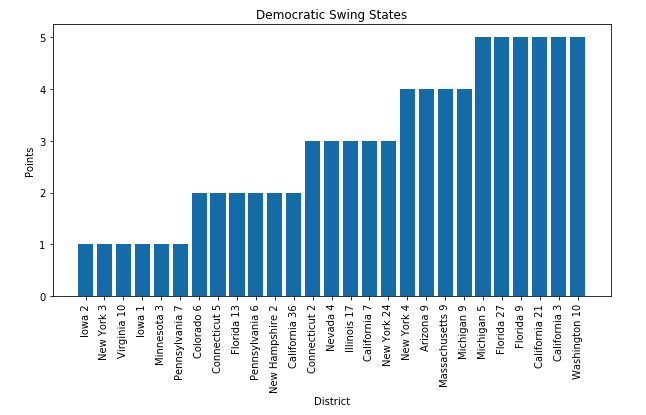
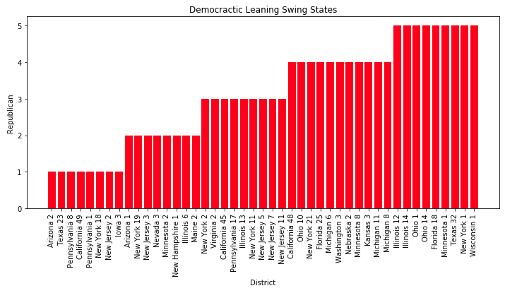
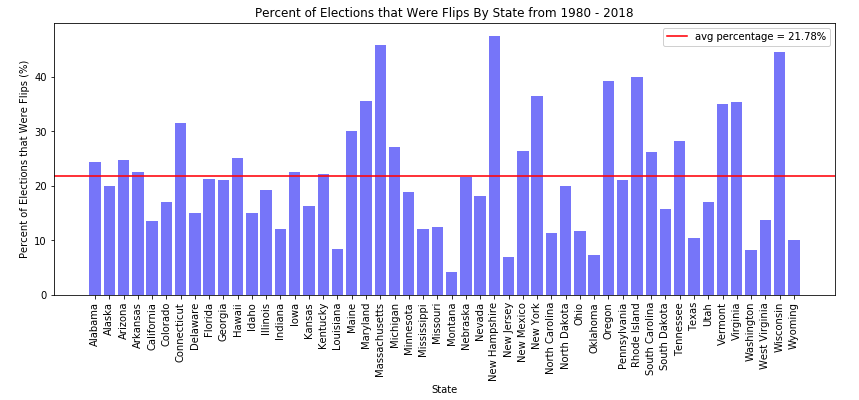

# Exploratory Data Analysis

## Description of Data

### Finding Swing States
By scraping the Cook Partisan Voting Index [wikipedia page](https://en.wikipedia.org/wiki/Cook_Partisan_Voting_Index) we were able to find that there are a substantial number of swing states that lean in both the Democratic and Republican direction.

Democratic Leaning Swing states

Republican Leaning Swing states

Percentage of Elections in Each State that were Flips from 1977-2018

