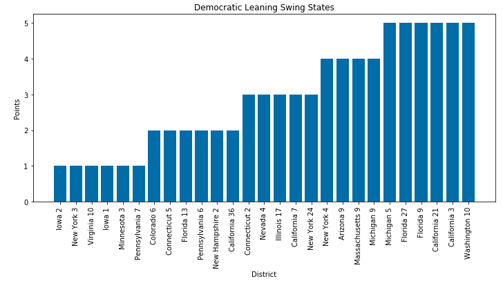
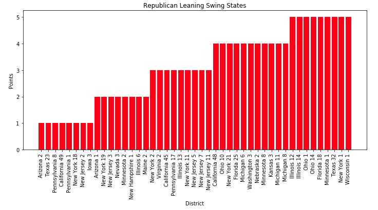
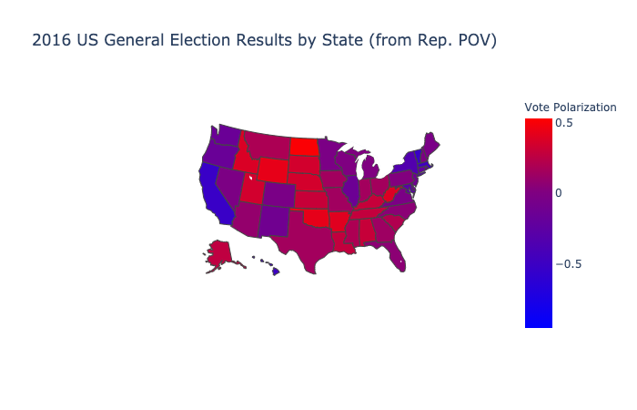

# Exploratory Data Analysis

## Description of Data

Some words here.

### Finding Swing States
In order to explore the current number of swing states, we used Beautiful Soup to scrape the Cook Partisan Voting Index [wikipedia page](https://en.wikipedia.org/wiki/Cook_Partisan_Voting_Index). Specifically we scraped a table sourced from the Cook Political Report's 2016 analysis for districts of the 116th United States Congress, calculated according to the results of the 2012 and the 2016 U.S. presidential elections.

The data scraped required some cleaning including stripping newline characters and converting string versions of integers to numerical values. The final table had the following structure:

| District  | PVI  | Party | Points |
|-----------|------|-------|--------|
| Alabama 1 | R+15 | R     | 15     |
| Alabama 2 | R+16 | R     | 16     |
| Alabama 3 | R+16 | R     | 16     |
| Alabama 4 | R+30 | R     | 30     |

Using this table we calculated the number of swings districts where a swing state is defined as any state with a score between D+5 and R+5. A district could also have a score of 'EVEN' if they showed no leaning in either direction. The following two graphs visualize the results.

```
swing_states_df = pvi_by_district_df.loc[(pvi_by_district_df['Points'] <= 5)]
dem_swings = swing_states_df[swing_states_df['Party'] == 'D'].sort_values(by=['Points'])
rep_swings = swing_states_df[swing_states_df['Party'] == 'R'].sort_values(by=['Points'])
even = swing_states_df[swing_states_df['PVI'] == 'EVEN']
```




The following districts had an even score.
- California 10
- California 25
- California 29
- Florida 7
- Oregon 4
- Oregon 5
- Washington 8
- Washington 3

### Flipping Trends by State

Next, we were interested in looking at trends in flipping where we define flipping to be a given district electing a candidate from the party their current candidate does **not** belong to (ex. a district with a sitting democratic representative electing a republican representative).

We used a data set that contained constituency (district) returns for elections to the House of Representatives from 1976 to 2018 to accomplish this task. Since each row in the original data set represented one candidate, we modified the data to have one row per district per year (ex. Alabama 1 1978) with a new column representing the election outcome in that district in that year (1 indicating a democratic candidate won and 0 indicating a republican candidate won). In addition, we wanted each entry to include information on the previous two elections in that district, so we added four additional columns, two representing the vote counts for the democratic and republican candidates in the n-1th election and two representing the vote counts for the democratic and republican candidates in the n-2th election. The final table had the following form:

| id           | year | state   | district | prev_dem_votes | prev_rep_votes | prev_total_votes | prev2_dem_votes | prev2_rep_votes | prev2_total_votes | res |
|--------------|------|---------|----------|----------------|----------------|------------------|-----------------|-----------------|-------------------|-----|
| 1980Alabama1 | 1980 | Alabama | 1        | 40450          | 71711          | 112161           | 58906           | 98257           | 157163            | 0   |
| 1980Alabama2 | 1980 | Alabama | 2        | 49341          | 57924          | 107265           | 66288           | 0               | 66288             | 0   |
| 1980Alabama3 | 1980 | Alabama | 3        | 0              | 0              | 0                | 106935          | 0               | 106935            | 0   |
| 1980Alabama4 | 1980 | Alabama | 4        | 87380          | 0              | 87380            | 141490          | 34531           | 176021            | 1   |


Next, we were interested in exploring if there were particular states that were more prone to having districts that flip. In order to do this, we calculated how many district elections in each state were flips from 1980-2018 and divided that number by the total number of elections in that state to give us a percentage of elections that were flips in that state over that time period. We obtained the following results:


### Flipping Trends by Year
We were also interested in looking for trends in the number of flips in all elections in a given year. We were able to do this by using our table that includes the results of the nth election and n-1^th election in one row. Our results indicated that there has been a decline in the number of swing districts in the previous two elections (2014 and 2016).

```
flips_by_year = {}
for i in range(1980, 2018, 2):
    flips = 0
    for j in range(len(past_elections[past_elections['year'] == i])):
        row = past_elections[past_elections['year'] == i].iloc[j]
        dems = int(row['prev_dem_votes'])
        reps = int(row['prev_rep_votes'])
        res = row['res'].bool()
        if dems > reps and res == False or dems < reps and res == True:
            flips += 1
    flips_by_year[i] = flips
```


Polarization of Voters Based on 2016 Presidential Election



Voting Trends in the Senate from 1976-2016

