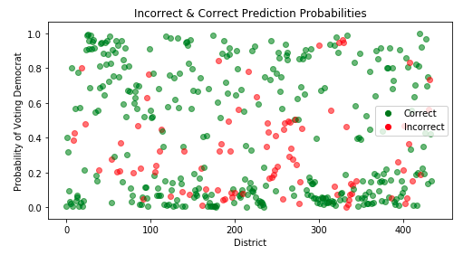

# Models

## Baseline Model
We wanted to create a fairly simple baseline model based off of previos midterm election results. We create a dataset where each row in the model represents a specific district in a specific year from 1976-2016 (see the EDA page for more info). Our predictors included state, district, and the number of votes for the republican candidates and democratic candidates in the 2 elections prior to the given election.

Because we could not use the current year's results as a predictor, we used the results from the previous two midterm elections in our model. For example, to predict the outcome of 2000Alabama1 we could not use the number of republican and democratic votes from that year (because we wouldn't have that for 2018), so instead we used the vote counts from 1998Alabama1 (one election prior) and 1996Alabama1 (two elections prior). Below we use the `all_past_elections` dataframe (described in EDA) to appropriately assign those values. We then combine these new results in a new data frame.

```
# separate into test and training data
columns = ['state']
past_elections_dummies = pd.get_dummies(past_elections, columns=columns, drop_first=True)

election_2018 = past_elections_dummies.loc[past_elections['year'] == 2018]
all_past_elections = past_elections_dummies.loc[past_elections['year'] != 2018]
```

```
past_res =  all_past_elections['res']
all_past_elections = all_past_elections.drop(columns=['res', 'id'])
election_res_2018 =  election_2018['res']
election_2018 = election_2018.drop(columns=['res', 'id'])
```

```
X_train, y_train = normalize(all_past_elections.astype(float)), past_res.astype(float)
X_test, y_test = normalize(election_2018.astype(float)), election_res_2018.astype(float)

log_model = LogisticRegression(C=100000, solver='lbfgs', max_iter=1000).fit(X_train, y_train)

y_pred_log_train = log_model.predict(X_train)
y_proba_log_test = log_model.predict_proba(X_train)

y_pred_log_test = log_model.predict(X_test)
y_proba_log_test = log_model.predict_proba(X_test)

train_acc = accuracy_score(y_train, y_pred_log_train)*100
test_acc = accuracy_score(y_test, y_pred_log_test)*100
```

The above model yielded the following results:

- **Training Accuracy Score**: 78.22%
- **Test Accuracy Score**: 79.08%



We created a confusion matrix of the results which yielded the following:

|         | Predicted 0 | Predicted 1 |
|------------------------|
|**Actual 0**| 187  | 16    |
|**Actual 1**| 75   | 157   |

From the above confusion matrix, we can see that the baseline model does an okay job of predicting election outcomes, but, for the test data, had a tendency to predict incorrectly for districts where democrats won.
